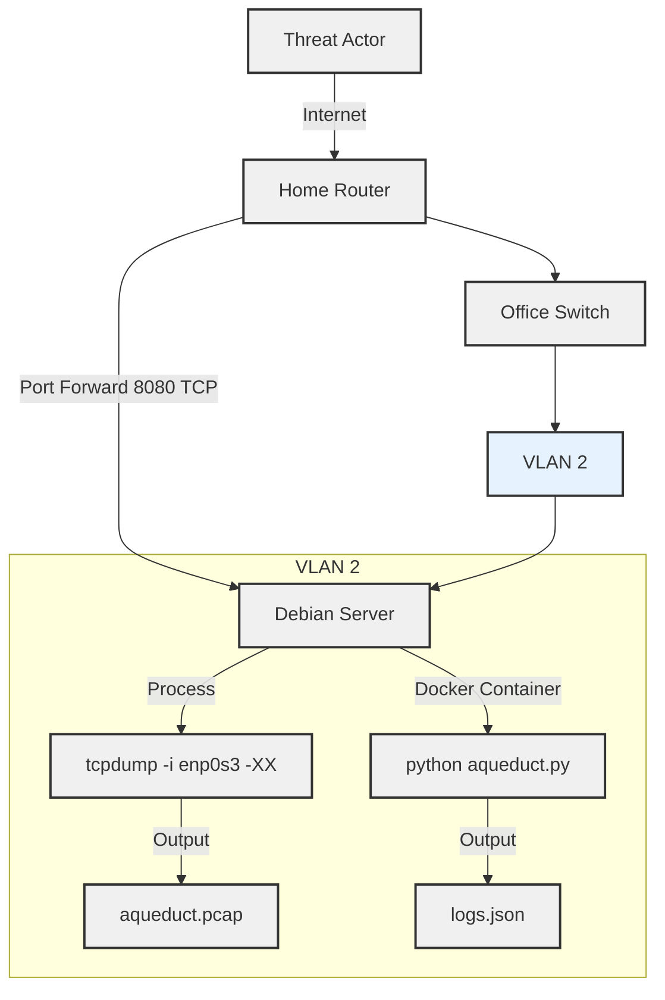

## Background

A few weeks ago, I happened upon a [LinkedIn post](https://www.linkedin.com/posts/mikeholcomb_what-does-an-icsot-cyber-attack-actually-activity-7221167138189783040-pxzb?utm_source=share&utm_medium=member_desktop) by Mike Holcomb about the Cyber Army of Russia Reborn (CARR) targeting a water facility's HMI. The post featured a video of the attack, showing a series of clicks and keystrokes that manipulated well controls to switch lead wells, adjust large well alternators, and reset hour meters. Mike noted that while no customers lost water service, the attack could have led to a tank overflow. This got me thinking about real-world attacks, their potential impact, and their frequency. I decided to simulate a water control system in my home office to see if I could catch any bad guys in the act.

## Designing the Honeypot

The first decision I faced was whether to host the honeypot on a cloud provider, a virtual machine, or a physical device. Typically, industrial control system honeypots in the cloud are easy to spot since they’re usually located within an on-premises ICS network. Shodan and Censys scanners generally identify and tag these as honeypots relatively quickly, rendering research less effective. By deploying the honeypot from my home office, I could better simulate a real-world water control system and potentially catch more sophisticated attacks. Additionally, I could mimic a device that would be more realistic to my geographic location by tailoring the HMI to appear as a local water control system. Fortunately, I had plenty of spare hardware on hand, including a mini PC with dual ports that I could later configure for advanced monitoring. With this in mind, I chose to use my mini PC running Debian 12 as the honeypot, running a containerized application to simulate the water control system. To protect the rest of my home network, I created a VLAN on my office switch and connected the mini PC to it, isolating it from the rest of the network. The network layout is shown below:



## Implementing the Honeypot

One thing I have learned about myself is that I am bad at naming things, which is not a fun trait to have as a software engineer. With this in mind, I dubbed this project `aqueduct`. Armed with a Python Flask application and some HTML, I was destined to find some bad guys. The script works very simply: it listens on port 8080 (as port 80 was immediately blocked by my ISP) and serves up a mostly static HTML page. I say "mostly static" because there are two additional pages that can be accessed from the landing screen. I crafted these pages with the intention of making them difficult to scan with automation. My goal was to force manual manipulation of the controls, pumps, and alternators. The following directory structure demonstrates how the honeypot is laid out:

```console
.
├── aqueduct.py
├── aqueduct.pcap
├── logs.json
├── requirements.txt
├── index.html
├── templates
│   ├── lift-station-details.html
│   ├── well-details.html
```

If you're interested in the HTML templates, you can find them [here](https://gist.github.com/RoseSecurity/5fc65f37fafc182568fa0dbdc9953db8) or craft your own with some GPT magic. The real work is done in `aqueduct.py`, where the landing page is rendered with links to the templates:

```py
# Render the water control home page
@app.route('/')
def index():
    return render_template('index.html')
```

These routes handle both GET and POST requests for the lift station details and well details pages. If a POST request is made, it captures the control action, the station being controlled, and the attacker's IP address. It's a simple and straightforward way of capturing webpage interactions and creates extremely readble and easily parsable logs.

```py
@app.route('/lift-station-details.html', methods=['GET', 'POST'])
def lift_station_details():
    if request.method == 'POST':
        control_request_data = {
            "control": request.form.get('station'),
            "action": request.form.get('action'),
            "ip_address": request.remote_addr
        }
        try:
            data = ControlRequest(**control_request_data)
            record_request(data.dict())
            return jsonify({"status": "success"}), 200
        except ValidationError as e:
            return jsonify({"status": "error", "errors": e.errors()}), 400
    return render_template('lift-station-details.html')

@app.route('/well-details.html', methods=['GET', 'POST'])
def well_details():
    if request.method == 'POST':
        control_request_data = {
            "control": request.form.get('control'),
            "action": request.form.get('action'),
            "ip_address": request.remote_addr
        }
        try:
            data = ControlRequest(**control_request_data)
            record_request(data.dict())
            return jsonify({"status": "success"}), 200
        except ValidationError as e:
            return jsonify({"status": "error", "errors": e.errors()}), 400
    return render_template('well-details.html')
```

The captured actions are written to a log file (`logs.json`) using the following function (as noted above, I also ran a packet capture to see what other traffic looked like hitting the server):

```py
def record_request(data):
    with open('logs.json', 'a') as f:
        json.dump(data, f)
        f.write('\n')
```

The final product looks like this!


To make the exposed server easily findable, I decided to leverage Shodan, a search engine for Internet-connected devices. By submitting a scan request to Shodan, I ensured that my honeypot would be indexed and visible to anyone using the service.

Here’s the command I used to submit the scan:

```sh
shodan scan submit <network or ip address>
```

With the honeypot now exposed, I waited to see how the world would interact with my simulated water control system... The results of this experiment? Maybe I'll share those insights next time!
