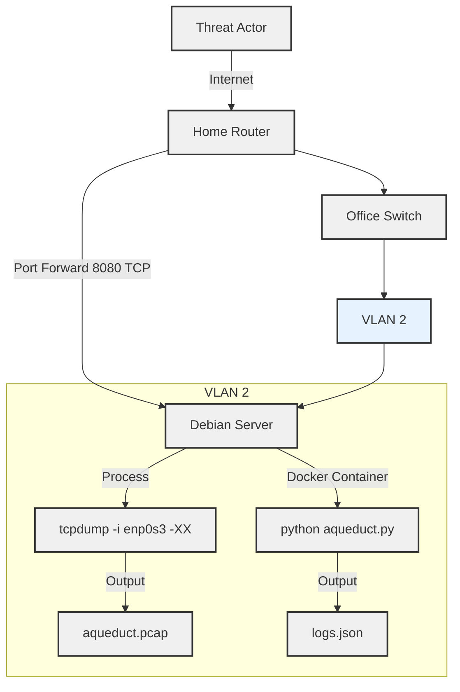

# Homegrown Honeypots: Simulating a Water Control System in my Home Office

## Background

A few weeks ago, I happened upon a [LinkedIn post](https://www.linkedin.com/posts/mikeholcomb_what-does-an-icsot-cyber-attack-actually-activity-7221167138189783040-pxzb?utm_source=share&utm_medium=member_desktop) by Mike Holcomb about the Cyber Army of Russia Reborn (CARR) attacking a water facility's HMI. The post included a video of the attack, which was a series of clicks and keystrokes that involved manipulating the well controls to switch lead wells, alter large well alternators, and reset hour meters. In the post, Mike mentioned that no customers had their water service impacted, although this attack could have resulted in a tank overflowing. This got me thinking about real life attacks, their potential impact, and the frequency of such attacks. I decided to simulate a water control system in my home office to see if I could catch any malicious activity.

## Designing the Honeypot

