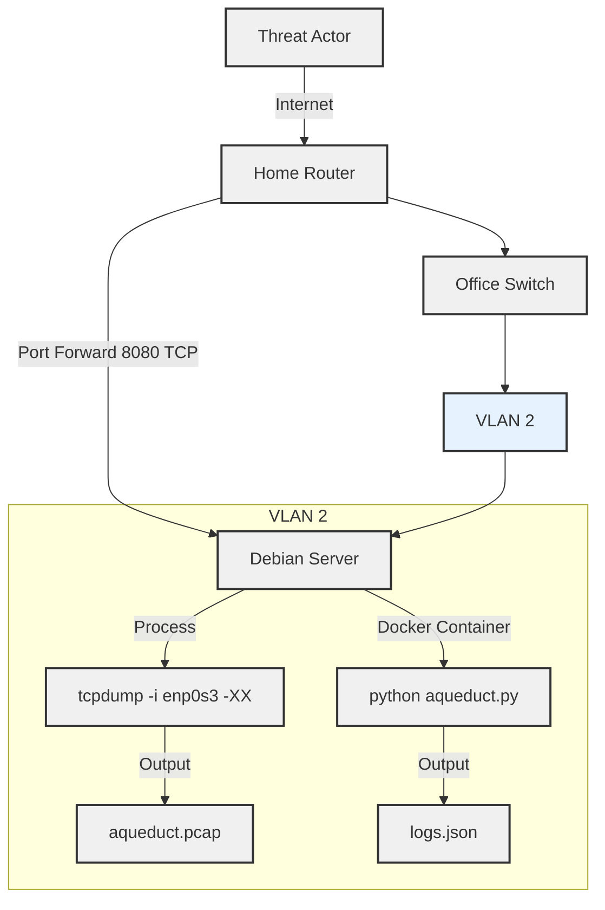

# Homegrown Honeypots: Simulating a Water Control System in my Home Office

## Background

A few weeks ago, I happened upon a [LinkedIn post](https://www.linkedin.com/posts/mikeholcomb_what-does-an-icsot-cyber-attack-actually-activity-7221167138189783040-pxzb?utm_source=share&utm_medium=member_desktop) by Mike Holcomb about the Cyber Army of Russia Reborn (CARR) targeting a water facility's HMI. The post featured a video of the attack, showing a series of clicks and keystrokes that manipulated well controls to switch lead wells, adjust large well alternators, and reset hour meters. Mike noted that while no customers lost water service, the attack could have led to a tank overflow. This got me thinking about real-world attacks, their potential impact, and their frequency. I decided to simulate a water control system in my home office to see if I could detect any malicious activity.

## Designing the Honeypot

The first decision I faced was whether to host the honeypot on a cloud provider or a virtual machine, or to use a physical device. Typically, industrial control system honeypots in the cloud are easy to spot since they’re often located within a traditional on-premises network. By deploying the honeypot from my residence, I could better simulate a real-world water control system and potentially catch more sophisticated attacks. Fortunately, I had plenty of spare hardware on hand, including a mini PC with dual ports that I could later configure for advanced monitoring. With this in mind, I chose to use my mini PC running Debian 12 as the honeypot, running a containerized application to simulate the water control system. To protect the rest of my home network, I created a VLAN on my home router and connected the mini PC to it, isolating it from the rest of the network. The network layout is shown below:

## Implementing the Honeypot

To simulate the water control system, I created a Python script called aqueduct.py that listens on port 8080 for incoming connections (I avoided using the traditional port 80 as my ISP blocked it almost immediately). The script responds with a JSON object containing the current state of the water control system and logs incoming connections to a file called logs.json. To monitor network traffic, I used tcpdump to capture packets on the VLAN interface and save them to a file named aqueduct.pcap. Both the script and the tcpdump process run in a Docker container to ensure the honeypot is isolated from the host system. The architecture of the honeypot is shown below:
