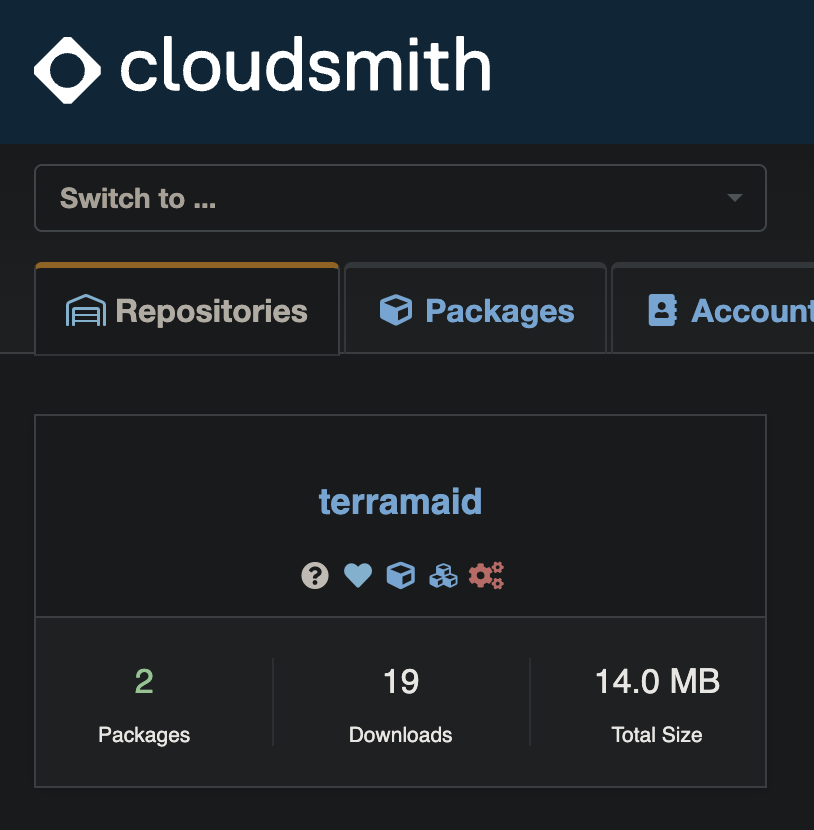

# From Source to System: Packaging and Delivering Tools to Debian-based Distros

## Introduction

As I've been developing new features and bug fixes for Terramaid, a tool that visualizes Terraform configurations using Mermaid, I've also focused on making the tool available on as many systems as possible. I've always valued having a straightforward and simple installation method (along with good documentation and even better code) for my tools. Throughout this learning journey, I've been fortunate to have contributors assist in making Terramaid accessible on Mac systems via Homebrew (thank you [Rui](https://github.com/chenrui333)) and on systems using Docker to spin up images of Terramaid (thank you [Tom](https://github.com/FalcoSuessgott)). These contributions have greatly increased the project's accessibility to many users I couldn't reach initially.

Currently, we support installation methods using Homebrew,Go installations, building from source, Docker images, and, as of yesterday, Debian-based systems via a Cloudsmith-hosted Apt repository. Today, I'd like to cover how I manage the repository using Infrastructure-as-Code, the manual process (soon to be automated) for building Debian packages for Terramaid, and how to use this installation method on Debian systems.

## Managing the Repository

Cloudsmith is a cloud-native, hosted package management service that supports a lot of native package and container technologies. I've previously written Terraform components for this service and found their management system straightforward, enabling quick and simple implementation. Another benefit is their generous free-tier for individual contributors and open-source projects, making the decision even easier. Below is my simple Terraform configuration for managing the repository (I created this in about five minutes, so please don't be too critical):

```terraform
# main.tf
# Please don't judge that the hardcoded parameters which aren't parameterized (yet)

data "cloudsmith_organization" "rosesecurity" {
  slug = "rosesecurity"
}

# Repository for Terramaid packages
resource "cloudsmith_repository" "terramaid" {
  description = "Terramaid Apt Package Repository"
  name        = "Terramaid"
  namespace   = data.cloudsmith_organization.rosesecurity.slug_perm
  slug        = "terramaid"

  # Privileges
  copy_own          = true
  copy_packages     = "Write"
  replace_packages  = "Write"
  default_privilege = "Read"
  delete_packages   = "Admin"
  view_statistics   = "Read"

  # Package settings
  repository_type            = "Public"
  use_debian_labels          = true
  use_vulnerability_scanning = true

  raw_package_index_enabled            = true
  raw_package_index_signatures_enabled = true
}

resource "cloudsmith_license_policy" "terramaid_policy" {
  name                    = "Terramaid License Policy"
  description             = "Terramaid license policy"
  spdx_identifiers        = ["Apache-2.0"]
  on_violation_quarantine = true
  organization            = data.cloudsmith_organization.rosesecurity.slug
}
```

This configuration creates a package repository and adds a Cloudsmith license policy to ensure that software is used, modified, and distributed in compliance with licensing requirements. I typically utilize Apache 2.0 licensing for my projects, as I appreciate the permissive nature and compatibility with other open-source license. Nevertheless, I digress; the created repository looks like the following:



## Pushing Packages

With our package repository created, we can begin testing how to push packages for distribution. I already have build pipelines defined for multi-architecture and platform Go builds, allowing for quick compilation of Linux AMD64 and ARM64 builds, which can then be packaged into `.deb` packages for distribution. To do this, I use a tool called `Effing Package Management`. I use a Mac, which already has Ruby installed, making for a quick Debian packaging experience. The `fpm` command takes three arguments:

- The type of sources to include in the package
- The type of package to output
- The sources themselves

I added a few more arguments for a comprehensive package, settling on the following command after building Terramaid for ARM and x64. The command is fairly self-explanatory:

```sh
fpm -s dir -t deb -n terramaid -v 1.12.0 \
--description "A utility for generating Mermaid diagrams from Terraform configurations" \
--license "Apache 2.0" --maintainer "rosesecurityresearch@proton.me" \
--url "https://github.com/RoseSecurity/Terramaid" --vendor "RoseSecurity" \
-a <ARCH> ./terramaid=/usr/local/bin/terramaid
```

Which created `terramaid_1.12.0_<ARCH>.deb`. With package in hand (or terminal), I decided to push it to the Cloudsmith repository using their provided CLI tool:

```console
❯ cloudsmith push deb rosesecurity/terramaid/any-distro/any-version terramaid_1.12.0_<ARCH>.deb

Checking deb package upload parameters ... OK
Checking terramaid_1.12.0_<ARCH>.deb file upload parameters ... OK
Requesting file upload for terramaid_1.12.0_<ARCH>.deb ... OK
Uploading terramaid_1.12.0_<ARCH>.deb:  [####################################]  100%
Creating a new deb package ... OK
Created: rosesecurity/terramaid/terramaid_1120_<ARCH>deb

Synchronising terramaid_1120_<ARCH>deb-czu0:  [####################################]  100%  Quarantined / Fully Synchronised

Package synchronised successfully in 19.456939 second(s)!
```

> **NOTE:** As an aside, the Cloudsmith CLI tool requires authentication, which can be done by running `cloudsmith login|token` or by providing your API key with the `-k` option.

## Downloading Packages

With the packages in the repository, I decided to download them onto a Debian-based system using the Cloudsmith-provided commands. I'm a big fan of Cloud Posse's Geodesic, a DevOps toolbox built on Debian that makes it easier for teams to use the same environment and tooling across multiple platforms. It spins up a Docker container that simplifies interaction with your cloud environment and tools. I highly recommend it, and the following excerpts are from Geodesic:

```sh
⨠ cat /etc/os-release

PRETTY_NAME="Debian GNU/Linux 12 (bookworm)"
NAME="Debian GNU/Linux"
VERSION_ID="12"
VERSION="12 (bookworm)"
VERSION_CODENAME=bookworm
ID=debian
HOME_URL="https://www.debian.org/"
SUPPORT_URL="https://www.debian.org/support"
BUG_REPORT_URL="https://bugs.debian.org/"
```

Cloudsmith also provides a nifty setup script that configures the Apt repository on clients. It performs some GPG key wizardy and configures the Apt repository:

```sh
⨠ curl -1sLf \
  'https://dl.cloudsmith.io/public/rosesecurity/terramaid/setup.deb.sh' \
  | sudo -E bash
Executing the  setup script for the 'rosesecurity/terramaid' repository ...

   OK: Checking for required executable 'curl' ...
   OK: Checking for required executable 'apt-get' ...
   OK: Detecting your OS distribution and release using system methods ...
 ^^^^: ... Detected/provided for your OS/distribution, version and architecture:
 >>>>:
 >>>>: ... distro=debian  version=12  codename=bookworm  arch=aarch64
 >>>>:
   OK: Checking for apt dependency 'apt-transport-https' ...
   OK: Checking for apt dependency 'ca-certificates' ...
   OK: Checking for apt dependency 'gnupg' ...
   OK: Checking for apt signed-by key support ...
   OK: Importing 'rosesecurity/terramaid' repository GPG keys ...
   OK: Checking if upstream install config is OK ...
   OK: Installing 'rosesecurity/terramaid' repository via apt ...
   OK: Updating apt repository metadata cache ...
   OK: The repository has been installed successfully - You're ready to rock!
```

With the repository configured, we can download Terramaid using the following voodoo:

```sh
apt install terramaid=<VERSION>
```

In this case, it will look like:

```sh
⨠ apt install terramaid=1.12.0
Reading package lists... Done
Building dependency tree... Done
Reading state information... Done
The following NEW packages will be installed:
  terramaid
0 upgraded, 1 newly installed, 0 to remove and 10 not upgraded.
Need to get 7108 kB of archives.
After this operation, 13.5 MB of additional disk space will be used.
Get:1 https://dl.cloudsmith.io/public/rosesecurity/terramaid/deb/debian bookworm/main arm64 terramaid arm64 1.12.0 [7108 kB]
Fetched 7108 kB in 1s (5239 kB/s)
Selecting previously unselected package terramaid.
(Reading database ... 23201 files and directories currently installed.)
Preparing to unpack .../terramaid_1.12.0_arm64.deb ...
Unpacking terramaid (1.12.0) ...
Setting up terramaid (1.12.0) ...
```

## Automating with GitHub Actions

To automate this process, we can use GitHub Actions coupled with Goreleaser and Cloudsmith's CLI tooling to build and push artifacts to Cloudsmith. In the following workflow, we build and release the CLI tooling before pushing to Cloudsmith: 

```yaml
jobs:
  build:
    name: "Build CLI and Attach to GitHub Release"
    runs-on: ubuntu-latest
    steps:
      - uses: actions/checkout@v4
        with:
          fetch-depth: 0

      # Setup Go
      - name: "Setup Go"
        uses: actions/setup-go@v5
        with:
          go-version-file: "go.mod"

      # Print Go version
      - run: go version

      # Build and release
      - name: Run GoReleaser
        uses: goreleaser/goreleaser-action@v6
        with:
          version: latest
          args: release --parallelism 2 --clean
        env:
          GITHUB_TOKEN: ${{ secrets.GH_TOKEN }}

      - name: Get Debian Package Names
        id: deb_package
        run: |
          echo "ARM_PACKAGE=$(find dist/ -name '*arm64.deb' | head -n 1)" >> $GITHUB_ENV
          echo "AMD_PACKAGE=$(find dist/ -name '*amd64.deb' | head -n 1)" >> $GITHUB_ENV

      # Push the Debian package to Cloudsmith
      - name: Push Debian ARM package to Cloudsmith
        id: push_arm
        uses: cloudsmith-io/action@master
        with:
          api-key: ${{ secrets.CLOUDSMITH_API_KEY }}
          command: "push"
          format: "deb"
          owner: "rosesecurity"
          repo: "kuzco"
          distro: "any-distro"
          release: "any-version"
          file: ${{ env.ARM_PACKAGE }}

      - name: Push Debian AMD package to Cloudsmith
        id: push_amd
        uses: cloudsmith-io/action@master
        with:
          api-key: ${{ secrets.CLOUDSMITH_API_KEY }}
          command: "push"
          format: "deb"
          owner: "rosesecurity"
          repo: "kuzco"
          distro: "any-distro"
          release: "any-version"
          file: ${{ env.AMD_PACKAGE }}
```

I hope this was informative for anyone looking to develop and distribute a tool to Debian systems. If you're interested in my work and would like to see more, feel free to check out my [GitHub](https://github.com/RoseSecurity) or reach out on my [LinkedIn](https://www.linkedin.com/in/rosesecurity/). I love empowering engineers to build cool things, so never hesitate to reach out with questions or thoughts. Let's build some stuff!

